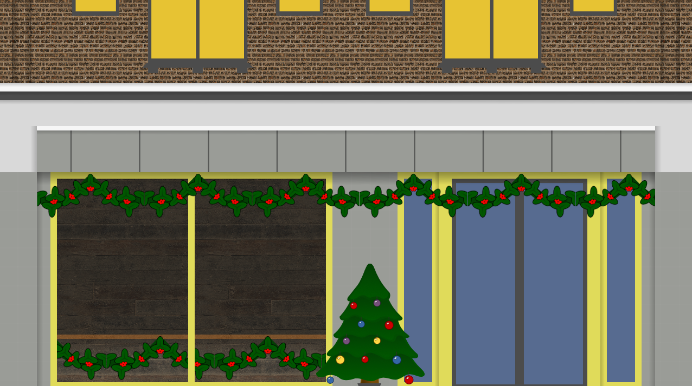

## Tiling Mode Showcase

### Description

This Example Sketch allows you to play around with the parameters of the 5 different TilingModes in order to figure out the best way to create a `TiledImage` for your own projects needs. You can either use this to better understand the 5 tiling modes, or as a way to quickly juggle between the 5 modes in order to pick the best one for your specific image.

### How to Use

To cycle between TilingModes, simply click anywhere in the Sketch. If you want to modify the parameters, you can edit them in the `TiledImage.pde` file.

## Intertoys Storefront

### Description

This Example Sketch is meant to showcase the abilities of this library on a larger-scale project. Most of the images in this project are `TiledImage` objects instead of PImage ones. You can also see different use cases for the library:
* Seamless repeated textures, such as the Bricks or Wooden Panels
* Infinitely scaling a texture on one axis, such as the Garland, Gradients or Pillar Tiles
* Adding 2/3 repeated PImage objects one next to the other, such as the Second Floor Windows
* Relative Positioning between `TiledImage` objects, as `xPos, yPos, xSize and ySize` are all public fields.

### How to Use

There is no interaction in this Sketch. If you want to see the code for how the Storefront is rendered, then you can check the `Storefront.pde` file.