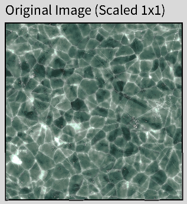
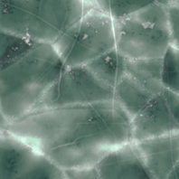
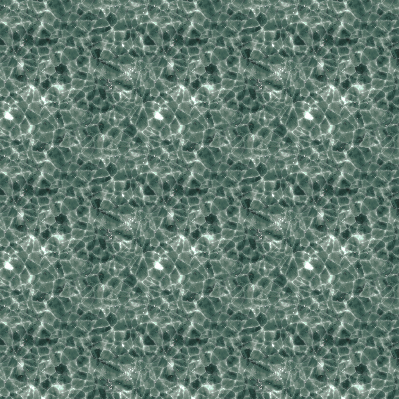
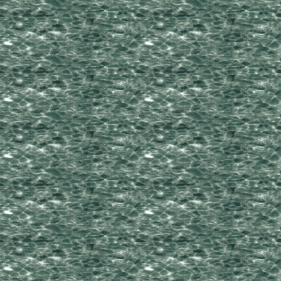
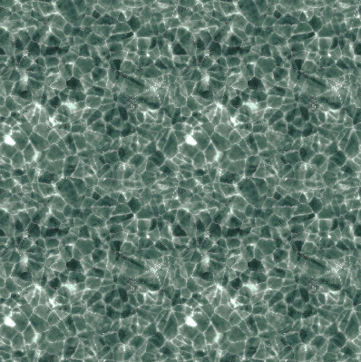
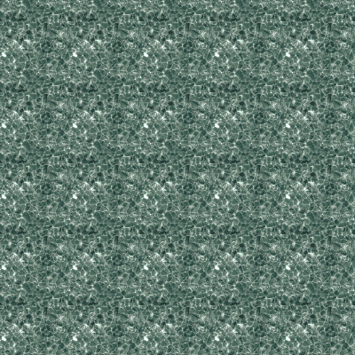

## Overview

ImageTiler supports 5 different TilingModes, which allow you to control parameters such as resolution, number of repetitions, etc. Changing TilingModes does not impact the final size or position of the TiledImage, but rather just the way in which the same asset is tiled within the confines of the first 4 parameters (`xPos, yPos, xSize, ySize`).

All of these examples will assume that the TiledImage objects were set up correctly. For an overview check [Getting Started](index.md), and for a more in-depth explanation check [API](api.md).

All of these examples will utilize the same source image as before.
<p align="center">
    
</p>

---

## Actual Size (Default)

This mode utilises the original resolution of the source image. If the source image is larger in resolution than the requested size of the TiledImage object, then it will simply be cropped. It automatically gets the image resolution from the `source_image`, so it only needs the position and size of the final TiledImage object.


### Source Code
```java
// PApplet, source_image, xPos, yPos, xSize, ySize
TiledImage actualSize = new TiledImage(this, source_image, 0, 0, 200, 200);
```

### Result
<p align="center">
    
</p>

---

## Fixed Size

This mode acts similarly to the Actual Size one, with the exception that it accepts a custom resolution for the source_image. This resolution is not restricted to the original aspect ratio of the `source_image`.

### Source Code
```java
// PApplet, source_image, xPos, yPos, xSize, ySize, xImgSize, yImgSize
TiledImage fixedSize = new TiledImage(this, source_image, 0, 0, 400, 400, 150, 150);
```

### Result
<p align="center">
    
</p>

---

## Image Count (Non-Constrained)

This mode is quite different from the other 2. Instead of the library computing the amount of images it needs to tile based on the given resolution, it expects that number on both the X and Y axis from the developer, and then automatically computes the required resolution by itself. In this way, you could have, for instance, a `TiledImage` which has exactly 2 repetitions of the `source_image` on the X-axis and 5 repetitions on the Y-axis.

### Source Code
```java
// PApplet, source_image, xPos, yPos, xSize, ySize, axisConstraint, xImgCount, yImgCount
TiledImage imageCount = new TiledImage(this, source_image, 0, 0, 400, 400, "", 2, 5);
```

### Result
<p align="center">
    
</p>

---

## Image Count (X Constrained)

This mode is identical to the previous one, with the exception that it prioritises the image count of a specific axis while also maintaining the original aspect ratio of the `source-image`. For X-Constrained, it will ensure that the xImgCount is satisfied by computing a specific image resolution that would ensure, in our case, that 2 instances of the `source_image` appear on the X-axis, while not distorting it, as opposed to the previous mode.

!!! warning "This mode essentially disregards `yImgCount`. It's still a used parameter, but you could essentially provide it with any integer `>0` and it will not impact the end-result."

### Source Code
```java
// PApplet, source_image, xPos, yPos, xSize, ySize, axisConstraint, xImgCount, yImgCount
TiledImage imageCount = new TiledImage(this, source_image, 0, 0, 400, 400, "x", 2, 5);
```

### Result
<p align="center">
    
</p>

---

## Image Count (Y Constrained)

This mode is identical to the previous one, with the exception that it prioritises the image count of a specific axis while also maintaining the original aspect ratio of the `source-image`. For Y-Constrained, it will ensure that the yImgCount is satisfied by computing a specific image resolution that would ensure, in our case, that 2 instances of the `source_image` appear on the Y-axis, while not distorting it, as opposed to the previous mode.

!!! warning "This mode essentially disregards `xImgCount`. It's still a used parameter, but you could essentially provide it with any integer `>0` and it will not impact the end-result."

### Source Code
```java
// PApplet, source_image, xPos, yPos, xSize, ySize, axisConstraint, xImgCount, yImgCount
TiledImage imageCount = new TiledImage(this, source_image, 0, 0, 400, 400, "y", 2, 5);
```

### Result
<p align="center">
    
</p>